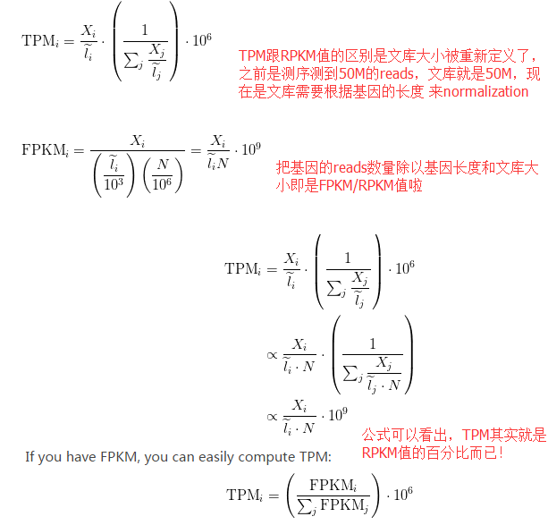

# TMP

## 1.定义
   TPM（Transcript Per Million):先对样本中的每个转录本的reads数进行长度标准化（假设用a表示），然后再求长度标准化后reads的总和（假设用N表示），再对a进行N标准化处理，得到TPM。与FPKM/RPKM区别是：FPKM/RPKM直接对每个转录本进行长度和数据总量的标准化，而TPM则是先长度标准化，再对标准化后的数据进行总量的标准化。实际上TPM为FPKM或者RPKM的百分比乘以1000000.
   
   具体计算公式参考.

## 2.优点：

    所有基因的TPM值和为1M，因为百分比的总和就是1，与样本无关，各个样本都可以保证TPM库是一样的，这样比较更有意义！

## 3.link
    http://www.bio-info-trainee.com/2017.html
